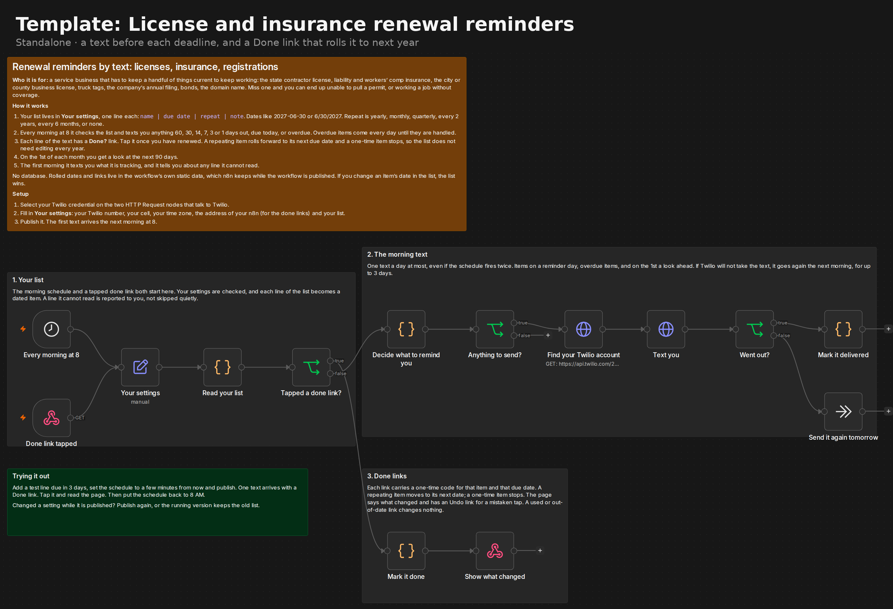

# License and insurance renewal reminders by text

A standalone n8n workflow that texts a service business owner before the things that keep them legal to work run out: the contractor license, liability and workers' comp insurance, the business license, truck tags, the company's annual filing, bonds, the domain name. Every text has a **Done** link. Tap it after renewing and a yearly item rolls forward to next year on its own, so the list never needs editing once it is set up.

It needs n8n and a Twilio account. No database, no spreadsheet, no community nodes, no AI model.



## The business problem

Renewals come once a year or once every two years, which is exactly often enough to forget them. A lapsed license can stop a shop from pulling permits. A lapsed policy means working a job without coverage. The dates usually live in someone's head, a paper folder or an email from last year. The fix is dull and that is the point: a text well ahead of each date, again as it gets close, and every day once it is late.

## What it does

1. Your list lives in the **Your settings** node, one line per item: `name | due date | repeat | note`.
2. Every morning at 8 it checks the list and sends one text with everything that is 60, 30, 14, 7, 3 or 1 days out, due today, or overdue. Overdue items come every day until they are handled.
3. Each line of the text has a **Done?** link. Tapping it opens a small page that says what changed:
   - a repeating item moves to its next due date, counted from the old due date, not from the day you tapped
   - a one-time item stops
   - tapped it by mistake? The page has an Undo link that puts the item back as it was
4. On the 1st of each month you get a look at the next 90 days.
5. The first morning after you publish it, you get a text saying what it is tracking and what is next. Any line it cannot read is reported, not skipped quietly.

One text a day at most, even if the schedule fires twice. If Twilio will not take the text, it goes again the next morning, for up to 3 days.

[examples/owner-texts.md](examples/owner-texts.md) shows the texts and the Done page.

## Your list

```
Contractor license | 2027-06-30 | every 2 years | Renew at the state licensing board
General liability insurance | 2027-01-15 | yearly | Call your agent
City business license | 2027-01-01 | yearly
Truck registration | 3/31/2027 | yearly
```

- **Dates**: `2027-06-30` or `6/30/2027`.
- **Repeat**: `yearly`, `monthly`, `quarterly`, `every 2 years`, `every 6 months`, `every 90 days`, or `none`. Blank means none.
- **Note** is optional and goes into the text as written, for example who to call.
- Lines starting with `#` are ignored.

If you change an item's date in the list after a Done link rolled it, the list wins, earlier or later.

## Requirements

- n8n Cloud or self-hosted n8n. Tested on n8n Cloud (2.39.7) and self-hosted n8n 2.40.5.
- Core nodes only: Schedule Trigger, Webhook, Set, Code, If, HTTP Request, Respond to Webhook and No Operation.
- A Twilio account, a number on it, and a Twilio credential in n8n.
- A number that can text your cell. In the US that means A2P 10DLC registration, or a verified toll-free number.

## Install

1. Import [`workflow/renewal-reminders-sms.json`](workflow/renewal-reminders-sms.json).
2. Select your Twilio credential on the two HTTP Request nodes: **Find your Twilio account** and **Text you**.
3. Fill in **Your settings** (below), including your list.
4. Publish it. The first text arrives the next morning at 8.

It will not run with the example phone numbers still in, or with done links on and no n8n address. The run stops in red in n8n and says why.

## Settings

| Setting | Default | What it does |
| --- | --- | --- |
| `business_name` | `Your Business` | Used in the first text |
| `business_number` | `+15555550100` | Your Twilio number. The texts come from it |
| `owner_cell` | `+15555550199` | Where the texts go |
| `timezone` | `America/New_York` | Decides what "today" is |
| `n8n_url` | `https://your-instance.app.n8n.cloud` | The address of your n8n, used to build the Done links |
| `items` | four example lines | Your list |
| `remind_days` | `60, 30, 14, 7, 3, 1, 0` | Days before the due date to text you. `0` is the due date itself |
| `overdue_every_days` | `1` | How often an overdue item comes back. `7` is weekly, `0` turns it off |
| `monthly_outlook` | `true` | The look ahead on the 1st of each month |
| `outlook_days` | `90` | How far that looks |
| `done_links` | `true` | Put a Done link on each line. With it off, you change dates in the list yourself |

The send time is on the **Every morning at 8** node, in your n8n time zone.

## Trying it out

1. Add a test line due in 3 days.
2. Set the schedule to a few minutes from now and publish.
3. One text arrives with a Done link. Tap it and read the page.
4. Put the schedule back to 8 AM and remove the test line.

On n8n 2.x a change to a published workflow does not reach the running copy until you publish again.

## Tests

- [`tests/renewals.test.js`](tests/renewals.test.js) runs the Code node source straight out of the workflow file with the clock frozen: 61 checks covering dates and repeats, reminder days, overdue cadence, the monthly look ahead, done links (rolling, one-time items, Undo, used links, wrong codes, a list date that wins), retries, the one-text-a-day guard, escaping on the Done page, and that the file ships with no credentials. `cd tests && npm install && node renewals.test.js`. CI runs it on every push.
- [`docs/VERIFIED-RESULTS.md`](docs/VERIFIED-RESULTS.md) has the runs in a real n8n.
- [`docs/DECISIONS.md`](docs/DECISIONS.md) explains the design choices.

## Limits

- **Memory needs a published workflow.** Rolled dates and links live in n8n's workflow static data, which n8n keeps only for published workflows. Runs started with the Execute button do not keep it.
- **Anyone with a Done link can use it.** The link carries a random one-time code for that item and due date, so it cannot be guessed, but a forwarded text is a forwarded link. The worst it can do is move one date forward, and changing that date in the list undoes it.
- **A text can run to several segments.** Twilio bills per segment of about 150 characters, and each item with its Done link is about one segment. The first text in the live test was about 700 characters.
- **A refused text is resent as it was written.** If Twilio refuses a text, it goes again the next morning with that day's text, so an item that is still due can appear twice, once with the old count.
- **One owner, one list.** Duplicate the workflow for a second person or a second business.
- **Subaccounts.** It uses the first active account the Twilio credential returns. If your credential can see subaccounts, use one for the account that owns the number.

## License

MIT. Use it, change it, sell it.

Built by [Mike Matthews](https://github.com/mikematthewsai). More standalone workflows and the full lead-response system: [n8n-lead-response](https://github.com/mikematthewsai/n8n-lead-response).
